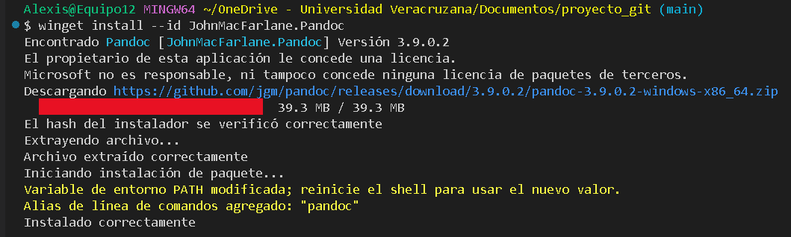
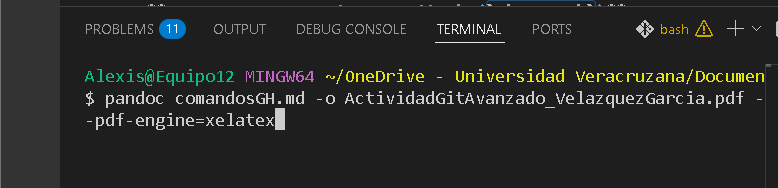

# 12 comandos GitHub CLI: Descripción, Función, Sintaxis y Ejemplo

En este documento se mostrará por cada comando en qué consiste, qué hace, la forma correcta de escribirlo en la línea de comandos y su correcto funcionamiento utilizado ya en un repositorio.

Se tiene una tabla donde se mostrará una descripción breve de cada comando elegido:

## Descripción general de su función

| Número | Comando | Descripción |
| :---: | :--- | :--- |
| 1 | `gh alias delete` | Elimina alias configurados previamente. |
| 2 | `gh copilot` | Ejecuta la interfaz de línea de comandos de GitHub Copilot. |
| 3 | `gh secret` | Administra secretos a nivel de repositorio u organización para uso en GitHub Actions, Dependabot o Codespaces. |
| 4 | `gh exit-codes` | Muestra las convenciones estándar que sigue `gh` con respecto a los códigos de salida (exit codes). |
| 5 | `gh reference` | Es un comando de ayuda global que despliega el manual completo y detallado listando absolutamente todos los comandos, subcomandos y parámetros disponibles. |
| 6 | `gh browse` | Transiciona de la terminal al navegador web para ver e interactuar con: Issues, Pull requests, contenido y configuración del repositorio. |
| 7 | `gh pr` | Administra y trabaja con los Pull Requests de GitHub. |
| 8 | `gh repo` | Administra y trabaja con repositorios de GitHub. |
| 9 | `gh cache delete` | Elimina cachés de GitHub Actions. Su eliminación requiere autorización previa con el alcance `repo`. |
| 10 | `gh alias` | Crea atajos personalizados para comandos de `gh` o permite agrupar múltiples comandos bajo un solo nombre. |
| 11 | `gh api` | Realiza una solicitud HTTP autenticada a la API de GitHub y muestra la respuesta. Admite endpoints v3 o acceso a GraphQL v4. |
| 12 | `gh search` | Realiza búsquedas de forma global a través de todo GitHub (repositorios, código, usuarios, etc.). |

---

## Utilidad de cada comando y sintaxis

A continuación se detalla el propósito de cada comando dentro del flujo de trabajo de desarrollo y su estructura sintáctica base.

**1. `gh alias delete`**
* **Utilidad:** Útil para mantener limpia la configuración de tu terminal, eliminando atajos de comandos obsoletos o creados por error.
* **Sintaxis:** `gh alias delete <nombre-del-alias> [flags]`

**2. `gh copilot`**
* **Utilidad:** Permite interactuar con la inteligencia artificial de Copilot sin salir de la terminal, ideal para solicitar sugerencias de comandos complejos en Bash, configuraciones de Git o scripts.
* **Sintaxis:** `gh copilot <command> [flags]`

**3. `gh secret`**
* **Utilidad:** Esencial para salvaguardar credenciales corporativas, tokens o claves de bases de datos que los flujos automatizados de CI/CD requieren sin exponerlos en el código fuente.
* **Sintaxis:** `gh secret <command> [flags]`

**4. `gh exit-codes`**
* **Utilidad:** Sirve como referencia técnica para la creación de scripts en Bash o Python. Permite identificar si un comando CLI se ejecutó con éxito (código 0) o si falló, facilitando el manejo de errores.
* **Sintaxis:** `gh help exit-codes`

**5. `gh reference`**
* **Utilidad:** Funciona como un manual offline exhaustivo (similar a las páginas `man` en Linux), ideal para consultar opciones avanzadas de la herramienta sin depender de un navegador de internet.
* **Sintaxis:** `gh reference`

**6. `gh browse`**
* **Utilidad:** Ahorra clics y tiempo de navegación al abrir directamente la página exacta del repositorio remoto en el navegador predeterminado desde la carpeta de trabajo actual.
* **Sintaxis:** `gh browse [<number> | <path>] [flags]`

**7. `gh pr`**
* **Utilidad:** Agiliza el flujo de trabajo colaborativo permitiendo crear, revisar, aprobar o fusionar propuestas de cambios directamente desde la terminal de Git Bash.
* **Sintaxis:** `gh pr <command> [flags]`

**8. `gh repo`**
* **Utilidad:** Facilita la administración total de los repositorios remotos (crear, clonar, hacer forks o eliminarlos) integrando perfectamente las capacidades web de GitHub al entorno local.
* **Sintaxis:** `gh repo <command> [flags]`

**9. `gh cache delete`**
* **Utilidad:** Optimiza el espacio de almacenamiento y previene errores en las pruebas automatizadas al purgar archivos temporales y dependencias oxidadas en GitHub Actions.
* **Sintaxis:** `gh cache delete [<cache-id> | <cache-key> | --all] [flags]`

**10. `gh alias`**
* **Utilidad:** Incrementa la productividad del desarrollador al abreviar comandos largos que se usan con frecuencia durante el desarrollo de proyectos.
* **Sintaxis:** `gh alias <command> [flags]`

**11. `gh api`**
* **Utilidad:** Otorga flexibilidad absoluta al permitir consultas directas a los servidores de GitHub; útil para obtener datos estructurados (como JSON) que la CLI no extrae por defecto.
* **Sintaxis:** `gh api <endpoint> [flags]`

**12. `gh search`**
* **Utilidad:** Actúa como un motor de descubrimiento rápido para localizar fragmentos de código, librerías o proyectos open-source específicos sin interrumpir el ritmo de programación en la terminal.
* **Sintaxis:** `gh search <command> [query] [flags]`

---

## Ejemplos de ejecución

**1. Eliminar un alias configurado (`gh alias delete`)**
```bash
gh alias delete pv
```

Elimina el atajado de comando que habia sido guardado previamente con el nombre 'pv'.

**2. Solicitar asistencia de código(`gh copilot `)**
```bash
gh copilot suggest "Cómo compilar un proyecto de Java en la terminal"
```
Pide a la IA una sugerencia exacta sobre los comandos necesarios para realizar esa acción.

**3. Crear un secreto en el repositorio (gh secret)**
```bash
gh secret set DB_PASSWORD
```
La terminal solicitará ingresar de manera segura la contraseña de la base de datos para registrarla en el repositorio remoto.

**4. Consultar los códigos de salida (gh exit-codes)**

```bash
gh help exit-codes
```
Despliega la documentación detallada sobre cómo gh reporta sus éxitos y errores al sistema operativo.

**5. Abrir la referencia completa offline (gh reference)**

```bash
gh reference
```
Inicia el despliegue paginado del manual de todas las funcionalidades de GitHub CLI.

**6. Navegar rápidamente al código remoto (gh browse)**

```bash
gh browse settings
```
Abre automáticamente el navegador en la pestaña de "Configuración" del repositorio en el que se encuentra localmente.

**7. Crear un Pull Request (gh pr)**

```bash
gh pr create --title "Corrección de errores" --body "Se actualizó la lógica"
```
Sube el cambio al repositorio original agregando de forma inmediata un título y un cuerpo explicativo.

**8. Clonar un repositorio remoto (gh repo)**

```bash
gh repo clone lolmedo-99/repositorio
```
Descarga una copia idéntica del repositorio especificado directamente a la computadora local.

**9. Limpiar caché de flujos de trabajo (gh cache delete)**

```bash
gh cache delete --all
```
Limpia absolutamente todos los cachés almacenados en las GitHub Actions del repositorio actual.

**10. Configurar un nuevo alias (gh alias)**

```bash
gh alias set co checkout
```
Crea el alias 'co', permitiendo escribir gh co en lugar de teclear gh checkout en futuras ocasiones.

**11. Consultar la API de GitHub (gh api)**

```bash
gh api repos/Paola1426/repositorio2/issues
```

Realiza una petición HTTP GET para obtener la lista de incidencias (issues) del repositorio de Paola1426 y la devuelve en la consola.

**12. Buscar proyectos en GitHub (gh search)**

```bash
gh search repos "digital logic simulator" --language=python
```
Busca en todo GitHub repositorios relacionados con simuladores lógicos digitales que estén programados específicamente en Python.

## Evidencia de conversión de Markdown a PDF con Pandoc

### Pandoc descargado desde terminal



### Comando ejecutado para la conversión a PDF
 